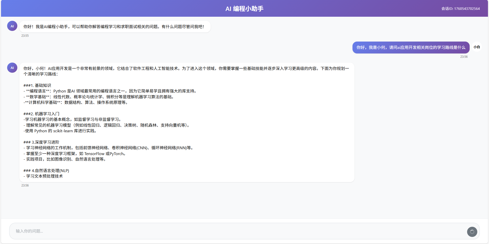
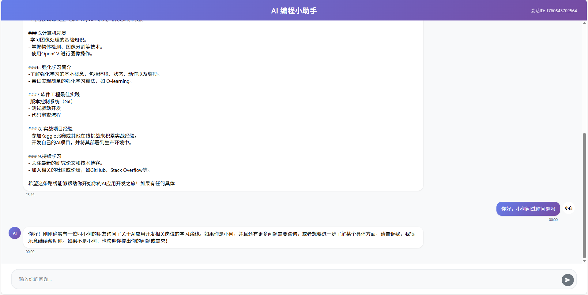
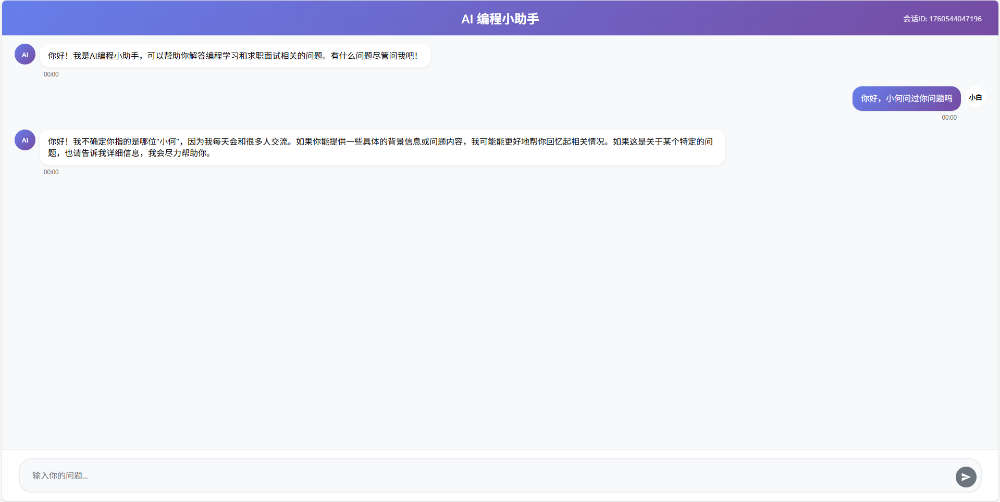
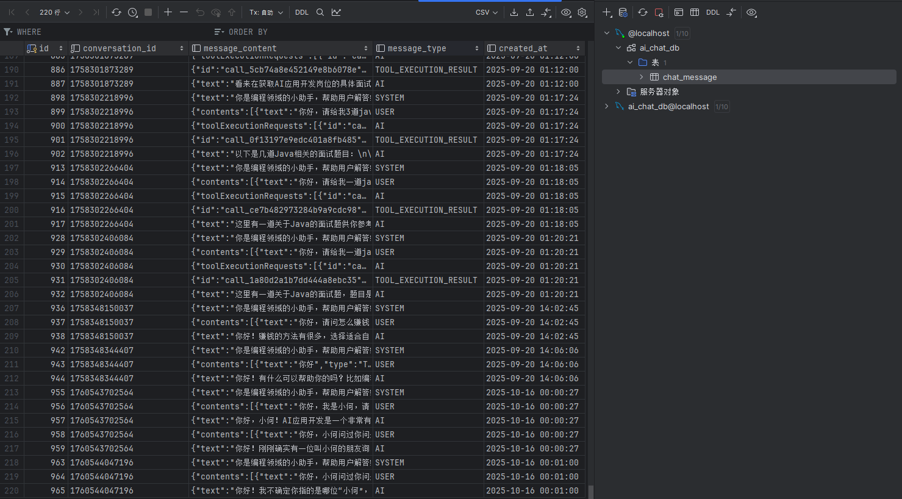

# 🤖 AI 编程小助手（全栈）

> 基于 Spring Boot + Vue3 + LangChain4j + 通义千问 的 AI 编程学习与求职辅导助手。

[](https://spring.io/projects/spring-boot)
[](https://vuejs.org/)
[](https://github.com/langchain4j/langchain4j)
[](https://www.oracle.com/java/)


## ✨ 概览

- **AI 能力**：集成 LangChain4j，接入通义千问（对话、嵌入、流式输出）。
- **实时体验**：SSE 流式输出，打字机体验顺滑。
- **安全防护**：输入安全检测（Guardrail），拦截敏感/风险内容。
- **工具增强**：RAG 检索、本地知识库、MCP 协议、面试题检索、简单爬虫集成。

## 🖼️ 可视化展示

| 功能 | 预览图 |
|------|--------|
| 流式输出展示 |  |
| 上下文展示 |  |
| 会话记忆展示 |  |
| 数据库展示 |  |


## 🧱 目录结构

```
ai-code-helper/
├─ ai-code-helper-frontend/            # 前端（Vue3 + Vite）
│  ├─ src/
│  │  ├─ components/
│  │  ├─ utils/
│  │  ├─ App.vue
│  │  └─ main.js
│  └─ README.md
├─ src/main/java/com/hejunhao/aicodehelper/   # 后端（Spring Boot）
│  ├─ AiController.java                # SSE `GET /ai/chat`
│  ├─ ChatController.java             # 其它REST接口
│  ├─ AiCodeHelperService.java        # 会话接口定义
│  ├─ AiCodeHelperServiceFactory.java # 装配AiServices
│  ├─ AiCodeHelperApplication.java    # 启动类
│  ├─ AiCodeHelper.java               # 简单示例服务
│  ├─ MySqlChatMemoryStore.java       # 会话记忆存储
│  ├─ ChatMessageEntity.java          # JPA实体
│  ├─ ChatMessageRepository.java      # JPA仓库
│  ├─ config/                         # CORS、RAG等配置
│  ├─ listener/                       # 模型监听
│  ├─ guardrail/                      # 安全防护
│  ├─ mcp/                            # MCP 客户端与工具
│  ├─ model/                          # 模型装配（如 `QwenChatModelConfig`）
│  └─ tools/                          # 工具集成（面试题等）
├─ src/main/resources/                 # `application.yml`、静态资源、系统提示词
├─ pom.xml
└─ README.md
```


## ⚙️ 环境要求

- Java 21+
- Maven 3.6+
- Node.js 16+
- 可用的通义千问/大模型 API 密钥


## 🚀 快速开始

### 1) 克隆并进入项目

```bash
git clone <repository-url>
cd ai-code-helper
```

### 2) 配置后端

在 `src/main/resources/application.yml` 中配置必要的密钥与参数（示例）：

```yaml
spring:
  application:
    name: ai-code-helper
  profiles:
    active: local
  datasource:
    url: jdbc:mysql://localhost:3306/ai_chat_db?useUnicode=true&characterEncoding=utf8&useSSL=false
    username: root
    password: 123456
    driver-class-name: com.mysql.cj.jdbc.Driver
  jpa:
    hibernate:
      ddl-auto: update
    show-sql: true
    database-platform: org.hibernate.dialect.MySQL8Dialect

langchain4j:
  community:
    dashscope:
      chat-model:
        model-name: qwen-max
        api-key: <YOUR_DASHSCOPE_API_KEY> # 通义千问密钥
      streaming-chat-model:
        model-name: qwen-max
        api-key: <YOUR_DASHSCOPE_API_KEY> # 通义千问密钥
    bigmodel:
      chat-model:
        model-name: glm-4
        api-key: <YOUR_API_KEY> # 智谱密钥


server:
  port: 8081
  servlet:
    context-path: /api
```

> 温馨提示：仓库未包含私密 `application.yml`，请按需创建；如不使用数据库，可先移除或注释数据源配置。

启动后端：

```bash
mvn spring-boot:run
```

### 3) 启动前端

```bash
cd ai-code-helper-frontend
npm install
npm run dev
```

### 4) 访问

- 前端：`http://localhost:3000`
- 后端：`http://localhost:8081/api`


## 🧩 技术架构

```
┌─────────────────┐    ┌─────────────────┐
│   Vue.js 前端    │────│  Spring Boot   │
│   - 聊天界面     │    │    后端服务      │
│   - 实时流式     │    │   - RESTful API │
│   - Markdown    │    │   - SSE 推送     │
└─────────────────┘    └─────────────────┘
                              │
                    ┌─────────────────┐
                    │   LangChain4j   │
                    │   - AI服务层    │
                    │   - 工具集成    │
                    │   - 安全防护    │
                    └─────────────────┘
                              │
                    ┌─────────────────┐
                    │   通义千问API    │
                    │   - 对话模型    │
                    │   - 嵌入模型    │
                    │   - 流式输出    │
                    └─────────────────┘
```


## 🔌 API 概览（后端）

- 基础地址：`http://localhost:8081/api`
- 聊天接口（SSE）：`GET /ai/chat`
  - 参数：
    - `memoryId`：会话 ID（数字）
    - `message`：用户消息（字符串）
  - 响应：`text/event-stream`（SSE 流）


## 🧠 核心模块（后端）

- `AiCodeHelperService`：核心对话与编排
- `QwenChatModelConfig`：通义千问模型配置
- `MySqlChatMemoryStore`：会话记忆（可选）
- `SafeInputGuardrail`：输入安全防护
- `InterviewQuestionTool`：面试题搜索工具
- `ChatModelListenerConfig`：对话监听与事件


## 📦 常用命令

后端：
```bash
mvn clean package
mvn spring-boot:run
```

前端（在 `ai-code-helper-frontend/` 下）：
```bash
npm install
npm run dev
npm run build
npm run preview
```


## 🛠 开发与调试建议

- 确保 CORS 允许 `http://localhost:3000` 访问后端。
- Windows PowerShell 环境下建议以管理员身份运行首次端口开放相关命令（如需要）。


## 🙏 致谢

- [LangChain4j](https://github.com/langchain4j/langchain4j)
- [阿里云通义千问](https://dashscope.aliyun.com/)
- [Spring Boot](https://spring.io/projects/spring-boot)
- [Vue.js](https://vuejs.org/)


---

前端详细说明请参阅 `ai-code-helper-frontend/README.md`。
