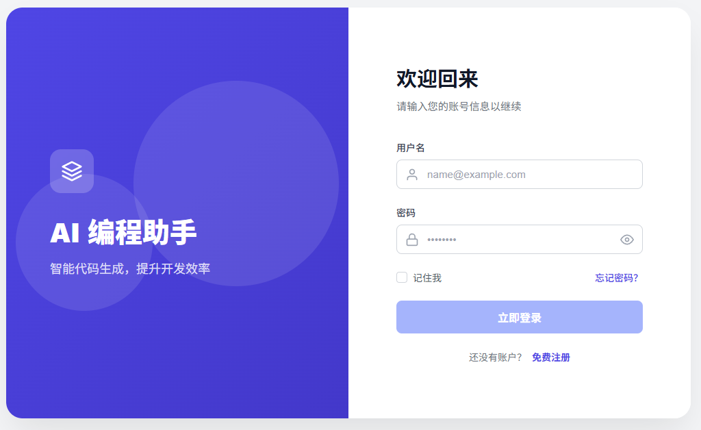
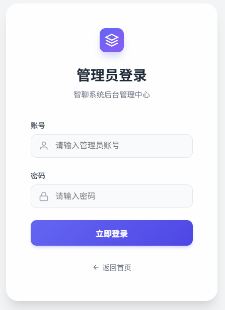
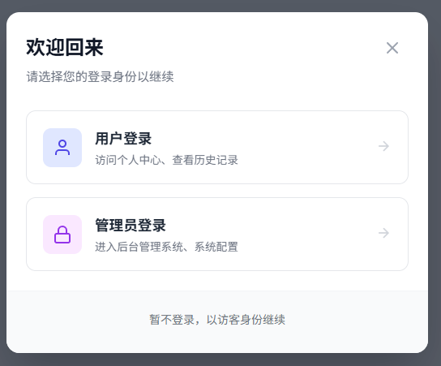
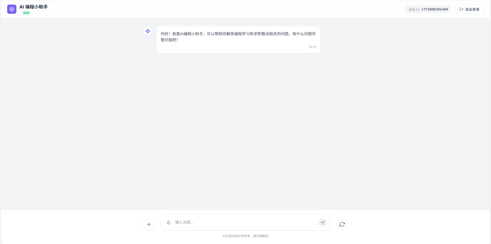
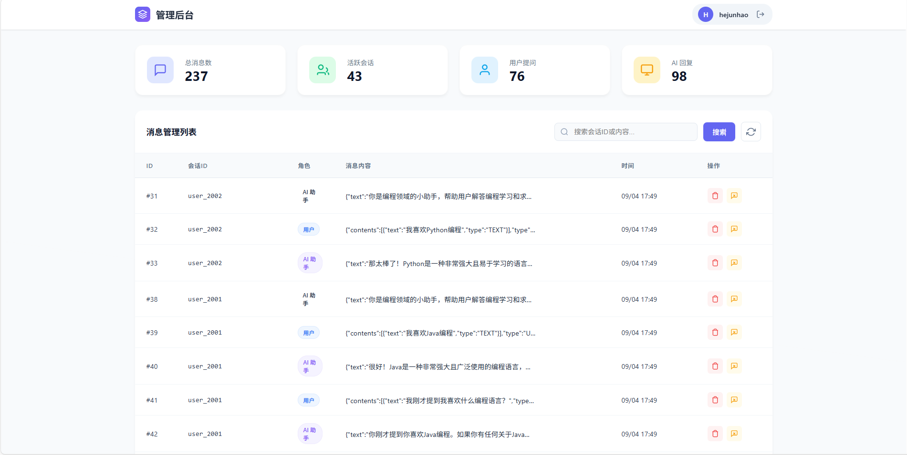

# 🤖 AI 编程小助手

> 基于 Spring Boot 3.5+ Vue3 + LangChain4j + 通义千问 的智能编程学习与求职辅导助手

[](https://spring.io/projects/spring-boot)
[](https://vuejs.org/)
[](https://github.com/langchain4j/langchain4j)
[](https://www.oracle.com/java/)

## ✨ 核心特性

| 特性 | 说明 |
|------|------|
| 🤖 **强大的 AI 引擎** | 集成 **LangChain4j**，默认使用 **Qwen-Max** 模型提供顶尖的对话与流式响应能力。 |
| 🧠 **RAG 检索增强** | 基于 `InMemoryEmbeddingStore` 和 **Text-Embedding-V4** 模型。系统启动时自动加载 `src/main/resources/docs` 下的 Markdown 文档，构建私有知识库。 |
| 🔌 **MCP 协议集成** | 实现了 **Model Context Protocol (MCP)** 客户端，通过智谱 BigModel 提供的 MCP 服务接入 **联网搜索 (Web Search)** 能力，赋予 AI 实时信息获取权限。 |
| 🛡️ **安全护栏 (Guardrails)** | 内置 `SafeInputGuardrail`，在 LLM 处理前对用户输入进行敏感词（如 "kill", "evil"）检测与拦截，确保交互安全。 |
| ⚡ **流式交互体验** | 后端采用 SSE (Server-Sent Events) 推送，前端结合打字机效果，实现低延迟的实时对话体验。 |
| 🎨 **富文本渲染** | 前端集成 `markdown-it` 和 `highlight.js`，完美支持 Markdown 格式解析与代码语法高亮。 |
| 📊 **全功能后台** | 提供管理员仪表盘，支持会话审计、消息检索与敏感内容管控。 |

## 📸 功能预览

<table>
  <tr>
    <td align="center"><b>登录界面</b><br/></td>
    <td align="center"><b>管理员登录界面</b><br/></td>
    <td align="center"><b>身份切换界面</b><br/></td>
    <td align="center"><b>用户界面</b><br/></td>
    <td align="center"><b>管理员界面</b><br/></td>
  </tr>
</table>

## 📁 项目结构

```
ai-code-helper/
├─ ai-code-helper-frontend/            # 前端（Vue3 + Vite）
│  ├─ src/
│  │  ├─ components/
│  │  │  ├─ ChatRoom.vue             # 聊天室组件
│  │  │  ├─ MessageInput.vue         # 消息输入组件
│  │  │  ├─ UserLogin.vue            # 用户登录页面
│  │  │  └─ LoginModal.vue           # 登录弹窗组件
│  │  ├─ router/
│  │  │  └─ index.js                 # 路由配置
│  │  ├─ utils/
│  │  ├─ App.vue
│  │  └─ main.js
│  └─ README.md
├─ src/main/java/com/hejunhao/aicodehelper/   # 后端（Spring Boot）
│  ├─ AiController.java                # SSE `GET /ai/chat`
│  ├─ ChatController.java             # 其它REST接口
│  ├─ UserController.java             # 用户认证接口
│  ├─ AiCodeHelperService.java        # 会话接口定义
│  ├─ AiCodeHelperServiceFactory.java # 装配AiServices
│  ├─ AiCodeHelperApplication.java    # 启动类
│  ├─ AiCodeHelper.java               # 简单示例服务
│  ├─ MySqlChatMemoryStore.java       # 会话记忆存储
│  ├─ ChatMessageEntity.java          # JPA实体
│  ├─ ChatMessageRepository.java      # JPA仓库
│  ├─ config/                         # CORS、RAG等配置
│  ├─ listener/                       # 模型监听
│  ├─ guardrail/                      # 安全防护
│  ├─ mcp/                            # MCP 客户端与工具
│  ├─ model/                          # 模型装配（如 `QwenChatModelConfig`）
│  └─ tools/                          # 工具集成（面试题等）
├─ src/main/resources/                 # `application.yml`、静态资源、系统提示词
├─ pom.xml
└─ README.md
```


## ⚙️ 环境要求

| 环境 | 版本要求 |
|------|----------|
| Java | 21+ |
| Maven | 3.6+ |
| Node.js | 16+ |
| MySQL | 5.7+ (可选) |
| API Key | 通义千问 / 智谱 GLM |

## 🚀 快速开始

### 1️⃣ 克隆项目

```bash
git clone <repository-url>
cd ai-code-helper
```

### 2️⃣ 配置后端

创建 `src/main/resources/application.yml`，配置必要参数：

```yaml
spring:
  datasource:
    url: jdbc:mysql://localhost:3306/ai_chat_db
    username: root
    password: 123456

langchain4j:
  community:
    dashscope:
      chat-model:
        api-key: <YOUR_DASHSCOPE_API_KEY>  # 通义千问密钥

server:
  port: 8081
  servlet:
    context-path: /api
```

> 💡 **提示**：完整配置示例请查看项目中的 `application.yml.example`

### 3️⃣ 启动服务

**启动后端：**
```bash
mvn spring-boot:run
```

**启动前端：**
```bash
cd ai-code-helper-frontend
npm install
npm run dev
```

### 4️⃣ 访问应用

| 服务 | 地址 | 说明     |
|------|------|--------|
| 🎨 **前端** | http://localhost:3000 | 聊天界面   |
| 🔌 **后端** | http://localhost:8081/api | API 服务 |
| 👤 **用户登录** | 点击首页"登录" | 先注册账号    |


## 🧩 技术架构

```
┌─────────────────┐    ┌─────────────────┐
│   Vue.js 前端    │────│  Spring Boot   │
│   - 聊天界面     │    │    后端服务      │
│   - 管理后台     │    │   - RESTful API │
│   - 用户系统     │    │   - SSE 推送     │
└─────────────────┘    └─────────────────┘
                              │
                    ┌─────────────────┐
                    │   LangChain4j   │
                    │   - AI服务层    │
                    │   - 工具集成    │
                    │   - 安全防护    │
                    └─────────────────┘
                              │
          ┌───────────────────┼───────────────────┐
          │                   │                   │
┌─────────────────┐  ┌─────────────────┐  ┌─────────────────┐
│   通义千问API    │  │   MCP Client    │  │    RAG 引擎     │
│   - 对话模型    │  │   - 联网搜索    │  │   - 职场知识库  │
│   - 嵌入模型    │  │   - 外部工具    │  │   - 面试题库    │
│   - 流式输出    │  │                 │  │                 │
└─────────────────┘  └─────────────────┘  └─────────────────┘
```


## 🔌 API 接口

**基础地址：** `http://localhost:8081/api`

### 💬 聊天接口

| 接口 | 方法 | 说明 |
|------|------|------|
| `/ai/chat` | GET (SSE) | 流式对话接口，参数：`memoryId`、`message` |

### 👤 用户认证接口

| 接口 | 方法 | 说明 | 鉴权 |
|------|------|------|------|
| `/user/register` | POST | 用户注册 | - |
| `/user/login` | POST | 用户登录 | - |
| `/user/reset-password` | POST | 重置密码 | - |
| `/user/verify` | GET | 验证 Token 有效性 | ✓ |
| `/user/info` | GET | 获取用户信息 | ✓ |
| `/user/logout` | POST | 用户登出 | ✓ |

### 🛡️ 管理员接口 (Admin)

| 接口 | 方法 | 说明 | 鉴权 |
|------|------|------|------|
| `/admin/login` | POST | 管理员登录 | - |
| `/admin/messages` | GET | 获取所有消息记录 | ✓ |
| `/admin/messages/search` | GET | 搜索消息内容 | ✓ |
| `/admin/messages/{id}` | DELETE | 删除单条消息 | ✓ |
| `/admin/conversations/{id}` | DELETE | 清空指定会话 | ✓ |

> 🔑 需要鉴权的接口请在请求头添加 `Authorization: <token>`

## 🔐 用户认证系统

### ✨ 主要功能

- **🔐 登录认证**：用户名/密码验证，Token-based 身份验证
- **👤 用户信息**：获取当前登录用户信息
- **🛡️ 安全保护**：路由守卫 + Token验证
- **💾 状态保持**：支持"记住我"功能

### 📝 使用指南

1. 点击首页 **"登录"** 按钮或访问登录页
2登录成功后即可使用完整功能

### ⚠️ 安全提示

> **生产环境必做：**
> - 修改默认账号密码
> - 使用加密算法（如 BCrypt）存储密码
> - 使用 JWT 替代简单 Token
> - 集成数据库存储用户信息

## 🧠 核心模块

| 模块 | 说明 |
|------|------|
| `AiCodeHelperService` | 核心对话与编排 |
| `Mcpconfig` |  MCP 协议客户端配置 |
| `AdminController` | 后台管理接口 |
| `QwenChatModelConfig` | 通义千问模型配置 |
| `MySqlChatMemoryStore` | 会话记忆存储 |
| `SafeInputGuardrail` | 输入安全防护 |
| `InterviewQuestionTool` | 面试题搜索工具 |
| `UserController` | 用户认证接口 |


## 📦 常用命令

<table>
<tr>
<td width="50%">

**后端命令**
```bash
# 编译打包
mvn clean package

# 启动服务
mvn spring-boot:run

# 跳过测试
mvn clean install -DskipTests
```

</td>
<td width="50%">

**前端命令**
```bash
# 安装依赖
npm install

# 开发模式
npm run dev

# 生产构建
npm run build
```

</td>
</tr>
</table>

## 🛠️ 开发建议

- **RAG 文档更新**：直接将 Markdown 文件放入 `src/main/resources/docs`，重启服务即可自动生效。
- **敏感词管理**：修改 `SafeInputGuardrail.java` 中的 `sensitiveWords` 集合。
- **Prompt 调整**：修改 `src/main/resources/system-prompt.txt` 调整 AI 人设。

## 📚 技术文档

- 📖 [LangChain4j 官方文档]
- 📖 [Spring Boot 文档]
- 📖 [Vue.js 3 文档]
- 📖 [通义千问 API]


## 🙏 致谢

- [LangChain4j]
- [阿里云通义千问]
- [Spring Boot]
- [Vue.js]


---

<div align="center">

**⭐ 如果这个项目对你有帮助，请给一个 Star ⭐**

Made with ❤️ by [hejunhao]

</div>
